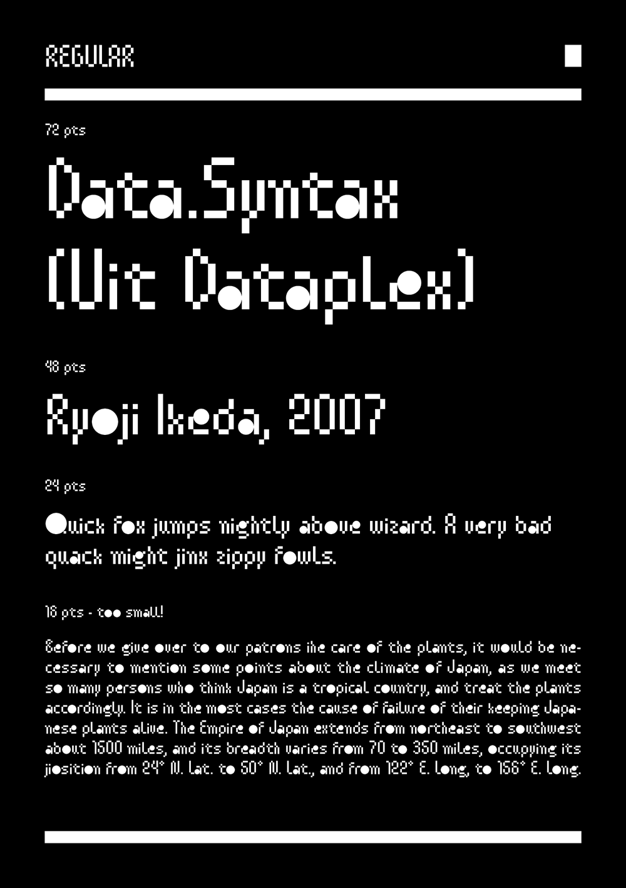
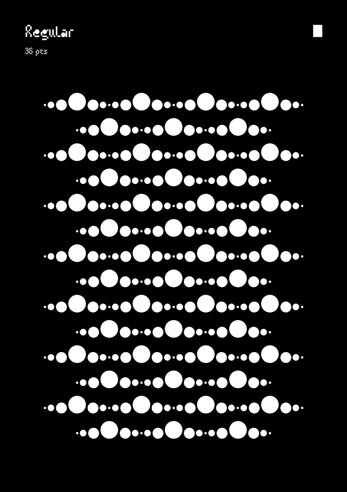
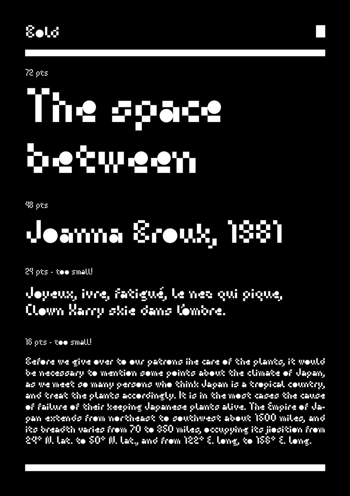
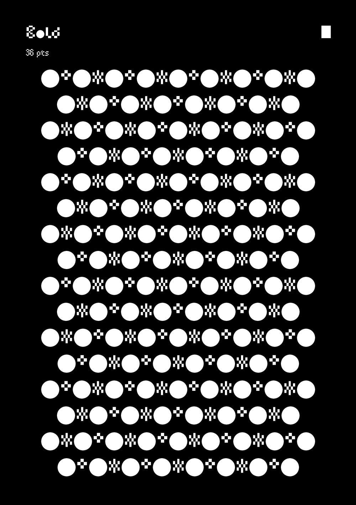

# Kobata

<strong>[EN]</strong>

Kobata is an experimental typeface based on some simple rules:
1) The only possible shapes are rectangles and circles. 
2) Rectangles can't touch each other on their sides to create more complex shapes, they can only meet by their corners. 
3) Circles are the only shape of which the size can be optically corrected by diverting from the 50*50 UPM grid. 
(I you want to modify and/or develop this typeface, please follow this rules).

The result is a geometric but functional font that takes some hints from calligraphy, embroidery and digital art. The succession of vertical strokes and square pixels create a visual interference, like a glitch in the font file. Elseways, the dark spots produced by the circles on the page look like raindrops falling on the surface of a pond. You can use it on short texts, for visual identity and art projects, to create a dramatic effect.

In March 2020, a bold style and a variable version were added to Kobata. The bold style is even more graphically strong and abstract than Kobata's regular weight. It also diverts further from the grid that it's expected for geometric fonts so create new contrast variations.

Kobata has been created by Ariel Martín Pérez (www.arielgraphisme.com - contact@arielgraphisme.com) and released under the SIL Open Font Licence 1.1 in 2020. Kobata is distributed by Tunera Type Foundry (www.tunera.xyz).

To know how to use this typeface, please read the FAQ (http://www.tunera.xyz/faq/) 

<strong>[FR]</strong>

Kobata est une fonte typographique expérimentale basée sur quelques règles simples :
1) Les seules formes possibles sont des rectangles et des ronds.
2) Les rectangles ne peuvent pas se toucher sur leurs côtés pour former des formes plus complexes. La seule manière dont ils peuvent se toucher c'est par leurs coins.
3) Les cercles sont la seule forme dont la taille peuve être corrigée optiquement, sans être confinés à la grille de 50*50 UPM.

Le résultat est une fonte géométrique mais fonctionnelle dont quelques détails se basent en la calligraphie, la couture et l'art numérique. La succésion de traits verticaux et de pixels carrés créent une interférence sur la page, comme une erreur dans la fonte numérique. Par ailleurs, les zones noires générées par les ronds ont l'aspect des goutes de pluie quand elles tombent sur la surface d'un étang. Vous pouvez utiliser Kobata sur des textes courts, dans des projets artistiques et d'identité visuelle, pour créer un effet dramatique.

En mars 2020, un style gras et une version variable ont été ajoutés à Kobata. Le style bold est encore plus abstrait et graphiquement impactant que le style regular. Aussi, il s'éloigne davantage de la grille de référence qui est attendue chez les fontes géométriques, pour générer des nouvelles nuances de contraste.

Kobata a été créé par Ariel Martín Pérez (www.arielgraphisme.com - contact@arielgraphisme.com) et publié sous la licence SIL Open Font License 1.1 en 2020. Kobata est distribué par Tunera Type Foundry (www.tunera.xyz).

Pour savoir comment utiliser cette fonte, veuillez lire la FAQ (http://www.tunera.xyz/faq-2/)

<strong>[ES]</strong>

Kobata es un tipo de letra experimental basado en unas cuantas reglas simples:
1) Las únicas formas posibles son rectángulos y círculos.
2) Los rectángulos no pueden tocarse por sus lados para crear formas más complejas, la única forma en la que pueden entrar en contacto es por sus esquinas.
3) Los círculos son la única forma que puede ser corregida ópticamente, sin tener en cuenta la cuadrícula de 50*50 UPM.

El resultado es un tipo de letra geométrico pero funcional que se inspira en la caligrafía, el bordado y el arte digital. La sucesión de trazos verticales y píxeles cuadrados crea una interferencia visual, como un error en el archivo de fuente. Por otro lado, las zonas oscuras producidas por los círculos sobre la página toman el aspecto de gotas de lluvia cayendo sobre la superficie de un estanque. Puede usarlo en textos cortos, para proyectos artísticos y de identidad visual, para crear un efecto dramático.

En marzo de 2020, un estilo en negrita y una versión variable fueron añadidos a Kobata. El estilo bold es todavía más abstracto y potente gráficamente que el estilo regular. También se aleja más aún de la rejilla de referencia de las fuentes geométricas para crear nuevos matices de contraste.

Kobata ha sido creado por Ariel Martín Pérez (www.arielgraphisme.com - contact@arielgraphisme.com) y publicado bajo la licencia SIL Open Font License 1.1 en 2020. Kobata es distribuido por Tunera Type Foundry (www.tunera.xyz).

Para saber cómo usar este tipo de letra, lea las preguntas frecuentes (http://www.tunera.xyz/preguntas-frecuentes/)

## Specimen

## License

Kobata is licensed under the SIL Open Font License, Version 1.1.
This license is copied below, and is also available with a FAQ at
http://scripts.sil.org/OFL

## Repository Layout

This font repository follows the Unified Font Repository v2.0,
a standard way to organize font project source files. Learn more at
https://github.com/unified-font-repository/Unified-Font-Repository
